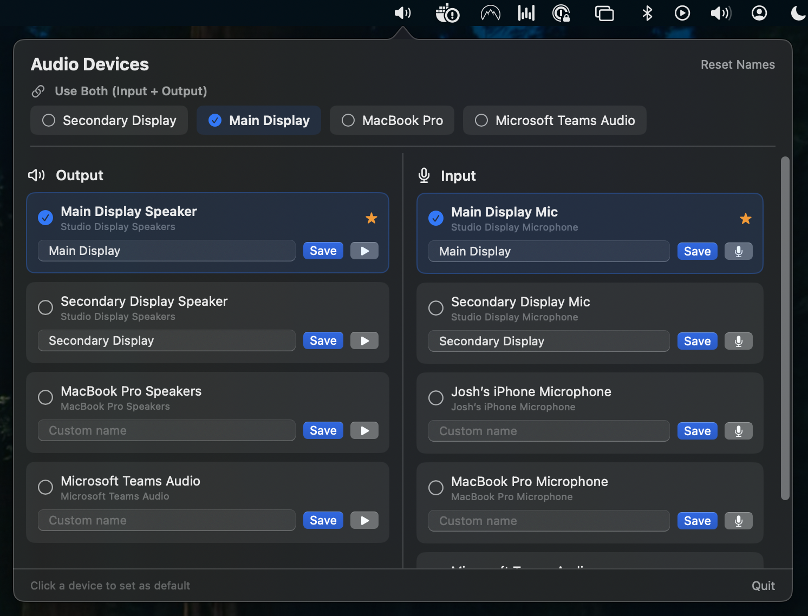

# macOS Audio Renamer

A lightweight macOS menu bar app for managing and renaming audio devices — particularly useful when you have multiple identical devices (like Apple Studio Displays) that macOS gives the same name.



## Origin

This project was originally inspired by the challenge of using multiple Apple Studio Displays, which share identical speaker and microphone names in macOS. It works with any audio device — external displays, USB interfaces, AirPods, built-in hardware, and virtual devices.

## Features

- **One-click switching** — set default input, output, or both from a single popover panel
- **Custom device names** — rename any device to something meaningful (e.g., "Studio Display Speakers" → "Main Display")
- **Paired device grouping** — speaker + mic pairs are linked for devices that share a name stem (Studio Displays, MacBook Pro, AirPods, etc.)
- **Use Both** — set a paired device as both input and output with one click
- **Auto-restore** — your preferred device is automatically re-selected when reconnected
- **Device testing** — play a test chime through any speaker, monitor mic input levels with a live meter
- **Two-column layout** — outputs on the left, inputs on the right for quick comparison
- **Persistent preferences** — custom names and preferred devices survive app restarts

## Install

### Download

1. Grab the latest `.dmg` from [Releases](../../releases)
2. Open the DMG and drag **macOS Audio Renamer** to Applications
3. Launch from Applications (first time: right-click > Open to bypass Gatekeeper)

### Build from source

Requires macOS 14+ and Swift 5.9+.

```bash
git clone https://github.com/jbmartino/macos-audio-renamer.git
cd macos-audio-renamer
swift build
.build/debug/MacOSAudioRenamer
```

## Tests

Run the standalone test script (no Xcode required):

```bash
swift Tests/run_tests.swift
```

On machines with Xcode installed, you can also use the SPM test target:

```bash
swift test
```

## Usage

1. Click the speaker icon in the menu bar
2. **Use Both** — sets a paired device as both input and output
3. **Output / Input** — click a device to set it as the default
4. **Rename** — type a custom name and click **Save**
5. **Test** — hit the play button to hear a chime on that speaker, or the mic button to see a live input level
6. Add to **System Settings > General > Login Items** to launch at startup

## How it works

Devices with unique hardware serials embedded in their CoreAudio UID (like Apple Studio Displays — e.g., `A1498802E` vs `C2210802E`) are identified and paired automatically, even when macOS gives them identical names.

For built-in devices (MacBook Pro, AirPods) and virtual devices (Microsoft Teams Audio), pairing is done by matching the device name stem after stripping suffixes like "Speakers" and "Microphone".

## Requirements

- macOS 14 (Sonoma) or later
- No Apple Developer account needed for personal use

## Support me

If you found this useful, consider supporting me!

[](https://ko-fi.com/jbmartino)
